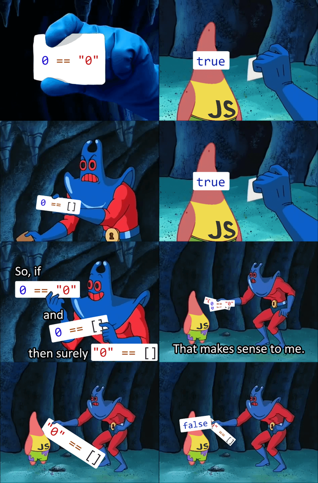
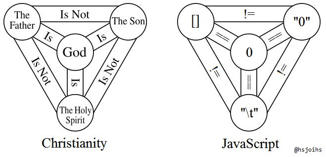

# Hackathon languages comparison
> https://www.craigstuntz.com/posts/2020-03-09-equality-is-hard.html

<!-- Remember one of the laws for equals comparisons is that they should be transitive: `if a = b and b = c then a = c`.
Unfortunately, when coupled with **type coersion**, languages often fail at this.

In JavaScript,

```js
'' == 0;      // true
0  == '0';    // true
'' == '0';    // false!
```

Never use `==` in JavaScript. Use `===` instead. -->

# JavaScript

Type coersion: tries to convert first, then compare.

ECMA script last version docs: https://tc39.es/ecma262/#sec-testing-and-comparison-operations

The specification might say something but the implementations will vary: https://kangax.github.io/compat-table/es2016plus/

## Comparison operators
> https://developer.mozilla.org/en-US/docs/Web/JavaScript/Reference/Operators/Comparison_Operators

JavaScript has both strict and type–converting comparisons.

* A strict comparison (e.g., ===) is only true if the operands are of the same type and the contents match.
* The more commonly-used abstract comparison (e.g. ==) converts the operands to the same type before making the comparison.
* For relational abstract comparisons (e.g., <=), the operands are first converted to primitives, then to the same type, before comparison.

Features:
* Two *strings* are *strictly* equal when they have the same sequence of characters, same length, and same characters in corresponding positions.
* Two *numbers* are *strictly* equal when they are numerically equal (have the same number value).
  * `NaN` *is not* equal to anything, including `NaN`.
    * `NaN == NaN \\ false`
    * `NaN === NaN \\ false`
  * Positive and negative zeros *are* equal to one another.
    * `-0 == +0 \\ true`
    * `-0 === +0 \\ true`
* Two Boolean operands are strictly equal if both are true or both are false.
* Two distinct *objects* are *never equal* for either strict or abstract comparisons.
* An expression comparing Objects is only true if the operands reference the *same Object*.
* `Null` and `Undefined` Types are *strictly equal* to themselves and *abstractly equal* to each other.

### Equality `==` & Inequality `!=`

* The equality operator *converts* the operands if they are not of the same type, then applies *strict comparison*.
* If both operands are objects, then JavaScript compares internal references which are equal when operands refer to the same object in memory.

```js
1    ==  1         // true
'1'  ==  1         // true
1    == '1'        // true
0    == false      // true
0    == null       // false
var object1 = {'key': 'value'}, object2 = {'key': 'value'};
object1 == object2 // false
0    == undefined  // false
null == undefined  // true
```

### Identity / strict equality `(===)` & Non-identity / strict inequality `(!==)`

The identity operator returns true/false if the operands are *strictly (in)equal* with *no type conversion*.

```js
3 === 3   // true
3 === '3' // false
var object1 = {'key': 'value'}, object2 = {'key': 'value'};
object1 === object2 //false
```

### Relational operators

* Each of these operators will *coerce* its operands to primitives before a comparison is made.
  * Type *coercion* is the *implicit* conversion of values from one data type to another (such as strings to numbers).
* If both end up as strings, they are compared using lexicographic order, otherwise they are cast to numbers to be compared.
* A comparison against `NaN` will always yield `false`.

```js
const value1 = '5';
const value2 = 9;
let sum = value1 + value2;

console.log(sum); // 59, JS choose to change 9 to string

// you can force to convert to number
sum = Number(value1) + value2;
```

### Using the equality operators

* Standard (Abstract) equality operators (`==` and `!=`) convert/coerce the type before comparing.
* Strict equality operators (`===` and `!==`) consider the type as is.

```js
// true as both operands are type String (i.e. string primitives):
'foo' === 'foo'

var a = new String('foo');
var b = new String('foo');

// false as a and b are type Object and reference different objects
a == b

// false as a and b are type Object and reference different objects
a === b

// true as a and 'foo' are of different type and, the Object (a)
// is converted to String 'foo' before comparison
a == 'foo'
```

## Integer
> https://developer.mozilla.org/en-US/docs/Web/JavaScript/Reference/Global_Objects/Number/isInteger
> https://tc39.es/ecma262/#sec-isinteger

`Number.isInteger(args)`

It determines if argument is a finite integer Number value. It performs the following steps when called:

```
If Type(argument) is not Number, return false.
If argument is NaN, +∞, or -∞, return false.
If floor(abs(argument)) ≠ abs(argument), return false.
Return true.
```

Examples:
```js
Number.isInteger(0);         // true
Number.isInteger(1);         // true
Number.isInteger(-100000);   // true
Number.isInteger(99999999999999999999999); // true

Number.isInteger(0.1);       // false
Number.isInteger(Math.PI);   // false

Number.isInteger(NaN);       // false
Number.isInteger(Infinity);  // false
Number.isInteger(-Infinity); // false
Number.isInteger('10');      // false
Number.isInteger(true);      // false
Number.isInteger(false);     // false
Number.isInteger([1]);       // false

Number.isInteger(5.0);       // true
Number.isInteger(5.000000000000001); // false
Number.isInteger(5.0000000000000001); // true
```

In the last case `Number.isInteger(5.0000000000000001);`, JS treat the number as 5.

Basic arithmetic is broken: `Number.MAX_SAFE_INTEGER - 0.1 === Number.MAX_SAFE_INTEGER` returns `true`.

## Edge cases and memes
> https://dev.to/damxipo/javascript-versus-memes-explaining-various-funny-memes-2o8c


<!--  -->

<!-- ```js
0 == "0" // true
0 == [] // true
0 == "\t" // true
[] == "\t" // false
[] == "0" // false
"\t" == "0" // false
``` -->
```js
0 == "0" // true
0 == [] // true
"0" == [] // false
```

* `0 == "0" -> true`: converts `"0"` to `0` before performing the comparison.
* `0 == [] -> true`:
  * The left operand is `number`.
  * The right operand is coerced to `number`.
  * `Number([]) -> false`, the false is coerced to number.
  * `Number(false) -> 0`.
  * Finally, `0 == 0` is `true`.
* `"0" == [] -> false`: No idea! Transitive property seems not be applied here because of coercion of the operand.

More cases:

```js
typeof NaN // 'number'
9999999999999999 // 10000000000000000
0.5+0.1 == 0.6 // true
0.1+0.2 == 0.3 // false, because 0.1+0.2 == 0.30000000000000004
true+true+true === 3 // true
true === 1 // false
[] == 0 // true
"11" + 1 // "111"
"11" - 1 // 10
```

* `typeof NaN = "number"`: `NaN` is a number and can't be compared with any other `NaN` (`NaN==NaN - false`)
* `9999999999999999 -> 10000000000000000 `: JS doesn't have integers, only 64-bit floats. You've ran out of floating-point precision represented with the constant `Number.MAX_SAFE_INTEGER` constant (which is broken).
* `0.5+0.1==0.6 -> true `: operation first, then comparison. All good.
* `0.1+0.2==0.3 -> false`: problem with operation and precision. I don't know why.
  * `0.1+0.2 -> 0.30000000000000004`
  * `0.30000000000000004 = 0.6 - false`
* `true+true+true === 3 -> true`: `true` is casted to `1` when is used with the `+` operator, so is converted to `1+1+1`.
* `true === 1 -> false`: strictly comparison, no coercion/conversion.
* `[] == 0 -> true `: Array to number conversion, `Number([])` is `0`, so `0==0`.
* `"11" + 1 -> "111"`: Concatenation between string and number the, last is casted to String.
* `"11" - 1 -> 10`: the `minus` operator force arithmetic evaluation.


# R
> https://www.rdocumentation.org/packages/base/versions/3.6.2/topics/Comparison

Do not use `==` and `!=` for tests, such as in if expressions, where you must get a single `TRUE` or `FALSE`. Unless you are absolutely sure that nothing unusual can happen, you should use the `identical function` instead.

[`identical` documentation](https://www.rdocumentation.org/packages/base/versions/3.6.2/topics/identical): The safe and reliable way to test two objects for being exactly equal. It returns TRUE in this case, FALSE in every other case.

```
# NOT RUN {
identical(1, NULL) ## FALSE -- don't try this with ==
identical(1, 1.)   ## TRUE in R (both are stored as doubles)
identical(1, as.integer(1)) ## FALSE, stored as different types

x <- 1.0; y <- 0.99999999999
## how to test for object equality allowing for numeric fuzz :
(E <- all.equal(x, y))
isTRUE(E) # which is simply defined to just use
identical(TRUE, E)
## If all.equal thinks the objects are different, it returns a
## character string, and the above expression evaluates to FALSE

## even for unusual R objects :
identical(.GlobalEnv, environment())

### ------- Pickyness Flags : -----------------------------

## the infamous example:
identical(0., -0.) # TRUE, i.e. not differentiated
identical(0., -0., num.eq = FALSE)
## similar:
identical(NaN, -NaN) # TRUE
identical(NaN, -NaN, single.NA = FALSE) # differ on bit-level

### For functions ("closure"s): ----------------------------------------------
###     ~~~~~~~~~
f <- function(x) x
f
g <- compiler::cmpfun(f)
g
identical(f, g)                        # TRUE, as bytecode is ignored by default
identical(f, g, ignore.bytecode=FALSE) # FALSE: bytecode differs

## GLM families contain several functions, some of which share an environment:
p1 <- poisson() ; p2 <- poisson()
identical(p1, p2)                          # FALSE
identical(p1, p2, ignore.environment=TRUE) # TRUE

## in interactive use, the 'keep.source' option is typically true:
op <- options(keep.source = TRUE) # and so, these have differing "srcref" :
f1 <- function() {}
f2 <- function() {}
identical(f1,f2)# ignore.srcref= TRUE : TRUE
identical(f1,f2,  ignore.srcref=FALSE)# FALSE
options(op) # revert to previous state
```

For numerical and complex values, remember == and != do not allow for the finite representation of fractions, nor for rounding error. Using all.equal with identical is almost always preferable.

[`all.equal` documentation](https://www.rdocumentation.org/packages/base/versions/3.6.2/topics/all.equal): `all.equal(x, y)` is a utility to compare R objects x and y testing 'near equality'. If they are different, comparison is still made to some extent, and a report of the differences is returned. Do not use all.equal directly in if expressions---either use `isTRUE(all.equal(....))` or `identical` if appropriate.

```
all.equal(pi, 355/113)
# not precise enough (default tol) > relative error

d45 <- pi*(1/4 + 1:10)
stopifnot(all.equal(tan(d45), rep(1, 10))) # TRUE, but
all      (tan(d45) == rep(1, 10))         # FALSE, since not exactly
all.equal(tan(d45), rep(1, 10), tolerance = 0)  # to see difference

## advanced: equality of environments
ae <- all.equal(as.environment("package:stats"),
                asNamespace("stats"))
stopifnot(is.character(ae), length(ae) > 10,
          ## were incorrectly "considered equal" in R <= 3.1.1
          all.equal(asNamespace("stats"), asNamespace("stats")))

## A situation where  'countEQ = TRUE' makes sense:
x1 <- x2 <- (1:100)/10;  x2[2] <- 1.1*x1[2]
## 99 out of 100 pairs (x1[i], x2[i]) are equal:
plot(x1,x2, main = "all.equal.numeric() -- not counting equal parts")
all.equal(x1,x2) ## "Mean relative difference: 0.1"
mtext(paste("all.equal(x1,x2) :", all.equal(x1,x2)), line= -2)
##' extract the 'Mean relative difference' as number:
all.eqNum <- function(...) as.numeric(sub(".*:", '', all.equal(...)))
set.seed(17)
## When x2 is jittered, typically all pairs (x1[i],x2[i]) do differ:
summary(r <- replicate(100, all.eqNum(x1, x2*(1+rnorm(x1)*1e-7))))
mtext(paste("mean(all.equal(x1, x2*(1 + eps_k))) {100 x} Mean rel.diff.=",
            signif(mean(r), 3)), line = -4, adj=0)
## With argument  countEQ=TRUE, get "the same" (w/o need for jittering):
mtext(paste("all.equal(x1,x2, countEQ=TRUE) :",
            signif(all.eqNum(x1,x2, countEQ=TRUE), 3)), line= -6, col=2)
```
